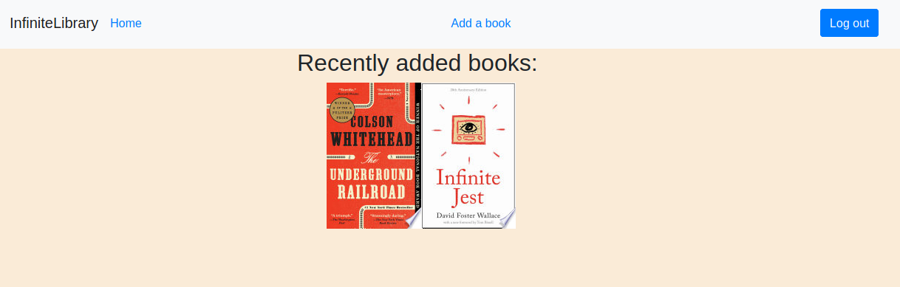

# InfiniteLibrary
*By Ivan Roth - [Visit InfiniteLibrary](http://the-infinite-library.herokuapp.com/)*

**Table of Contents**
* [InfiniteLibrary at a Glance](#infinitelibrary-at-a-glance)
* [Application Architecture & Technologies Used](#application-architecture)
* [Frontend Overview](#frontend-overview)
* [Backend Overview](#backend-overview)
* [Conclusion & Next Steps](#conclusion-and-next-steps)

## InfiniteLibrary at a Glance
InfiniteLibrary is a full-stack web app for listing and reviewing books, where users can add books to the collection and leave reviews for their friends to see.


##### InfiniteLibrary at a glance


InfiniteLibrary allows users to add bibliographic listings for books, with cover art automatically supplied via the Google Books API, and to add reviews to books already listed.

##### Adding books
<!--  -->

Users can add new books via a form which allows them to enter a title, author, and optionally a date of publication for the new bibliographic record. The app then automatically retrieves a matching cover image (if one exists) and generates the record.

## Frontend Overview
InfiniteLibrary uses an Express.js server on the frontend, with the React framework providing the interface. The frontend also interfaces with an external API to provide cover images automatically, via Google Books.

### Frontend Technologies Used:
#### React/Redux
The frontend server is written in React.js with Redux, allowing for a clear and directed flow of information between nested components. The Redux framework also allows backend calls to be centralized in a single "store", simplifying the interactions between backend and frontend into a single ``switch`` statement.

## Backend Overview
The backend server,

### Backend Technologies Used

### Google Books API
Using a registered Google API key, InfiniteLibrary makes calls to the Google Books API when a new book record is created, using the Google Books search functionality to retrieve the closest match to the user-supplied data, and then retrieving the cover image from that Google Books entry if one is available. The following code on the backend server accomplishes that task (here ``book`` is a JSON object containing the user-entered book information):

```
    const processedTitle = book.title.split(" ").join("+");
    const processedAuthorLastName = book.authorLastName.split(" ").join("+");
    const searchTerm = `intitle:"${processedTitle}"+inauthor:"${processedAuthorLastName}"`;
    const searchURL = `https://www.googleapis.com/books/v1/volumes?q=${searchTerm}&key=${process.env.API_KEY}`;
    const resolution = await fetch(searchURL);
    let imageURL = null;
    if (resolution.ok){
        const result = await resolution.json();
        const volumeURL = result.items[0].selfLink;
        const volumeRes = await fetch(volumeURL);
        if (volumeRes.ok){
            const volume = await volumeRes.json();
            console.log(volume);
            if (volume.volumeInfo.imageLinks) imageURL = volume.volumeInfo.imageLinks.thumbnail;
            console.log(imageURL);
        }
```

#### PostgreSQL
The database on the


## Conclusion and Next Steps

Thanks for reading! 📚
